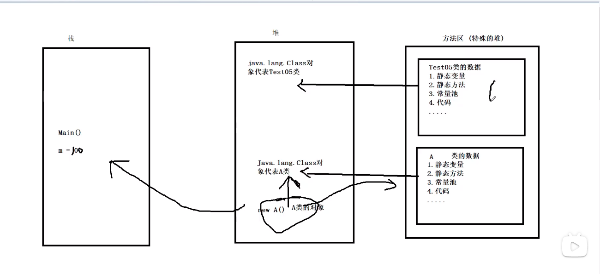

### 注解与反射

### 注解

```java
//三个内置注解//    @Override重写的注解@Deprecated @SuppressWarnings("all")
package com.kuang.annotation;

import java.util.ArrayList;
import java.util.List;

//什么是注解
public class Test01 extends Object{
//    @Override重写的注解
    @Override
    public  String toString() {
        return "zhujie";
    }
//   @Deprecated 不推荐程序猿使用，但可以使用，或者有更好的方式选择
    @Deprecated
    public static void test(){
        System.out.println("Deprecated");
    }
//    @SuppressWarnings("all") 抑制警告
    @SuppressWarnings("all")
    public static  void test02(){
        List list=new ArrayList();
    }

    public static void main(String[] args) {
        Test01 test01=new Test01();
//        System.out.println(test01.toString());
        test();
    }
}

```

### IDEA中java包分层显示的方式

> 小齿轮 >> Flatten Packages && Middle Packages的打钩状态取消 即可

### 元注解

>元注解的作用负责注解其他注解，java定义了4个标准的元注解（meta-annotation）
>
>@Target、@Retention、@Documented、@Inherited


```java
package com.kuang.annotation;

import java.lang.annotation.ElementType;
import java.lang.annotation.Target;

//测试元注解
@myannotation
public class Test02 {
    @myannotation
    public void test(){

    }
}
//自定义有个注解
//@Target 表示我们可以用在哪些地方（比如方法\类）

//@Retention 表示我们的注解在什么地方还有效（即生命周期：源码<类<运行）
@Retention(value = RetentionPolicy.RUNTIME)

//@Documented 表示是否将我们的注解生成在javadoc中
@Documented

//@Inherited 子类可以继承父类的注解
@Inherited
@Target(value = {ElementType.METHOD,ElementType.TYPE})
@interface myannotation{

}
```

### 自定义注解

```java
//自定义注解
public class Test03 {
    @MyAnnotation2(schools = {"西北大学","西工大"})
    public  void test(){}
    @MyAnnatation3("哈哈")
    public void test2(){}
}
@Target({ElementType.TYPE,ElementType.METHOD})
@Retention(RetentionPolicy.RUNTIME)
@interface MyAnnotation2{
    //注解的参数 参数类型 参数名称 ()
    String name() default "";
    int age() default 0;
    int id() default -1;//如果默认值为-1代表不存在
    String [] schools();
}
@Target({ElementType.TYPE,ElementType.METHOD})
@Retention(RetentionPolicy.RUNTIME)
@interface MyAnnatation3{
    String value();
}
```

### 实例化对象的方式

```java
package com.kuang.reflection;
//测试class类的创建方式有哪些(实例化对象的方式)
public class Test03 {
    public static void main(String[] args) throws ClassNotFoundException {
        Person person=new Student();
        System.out.println("这个人是："+person.name);
        //方式一：通过对象获得
        Class c1 = person.getClass();
        System.out.println(c1.hashCode());
        //方式二：forname获得
        Class c2 = Class.forName("com.kuang.reflection.Student");
        System.out.println(c2.hashCode());
        //方式三：通过类名.class
        Class c3 = Student.class;
        System.out.println(c3.hashCode());
        //方式四：基本内置对象型的包装类都有一个type属性
        Class c4 = Integer.TYPE;
        System.out.println(c4);

        //获得父类类型
        Class c5 = c1.getSuperclass();
        System.out.println(c5);
    }
}
class Person{
    public String name;

    public Person() {
    }

    public Person(String name) {
        this.name = name;
    }

    @Override
    public String toString() {
        return "Person{" +
                "name='" + name + '\'' +
                '}';
    }
}
class Student extends Person{
    public Student(){
        this.name="学生";
    }
}
class Teacher extends Person{
    public Teacher(){
        this.name="老师";
    }
}
```

### 哪些类型可以有Class对象

> class:外部类,成员(成员内部类,静态内部类),局部内部类,匿名内部类
>
> interface:接口
>
> []:数组
>
> enum:枚举
>
> annotation:注解@interface
>
> primitive type:基本数据类型
>
> void

```java
package com.kuang.reflection;

import java.lang.annotation.ElementType;

//所有类型的Class对象
public class Test04 {
    public static void main(String[] args) {
        Class c1 = Object.class;
        Class c2 = Comparable.class;//接口
        Class c3=String[].class;
        Class c4=int[][].class;
        Class c5=Override.class;//注解
        Class c6= ElementType.class;//枚举
        Class c7=Integer.class;//基本数据类型
        Class c8=void.class;//空类型
        Class c9=Class.class;
        System.out.println(c1);//ctrl+d复制一行,按alt键选择多个，再cv,快速复制
        System.out.println(c2);
        System.out.println(c3);
        System.out.println(c4);
        System.out.println(c5);
        System.out.println(c6);
        System.out.println(c7);
        System.out.println(c8);
        System.out.println(c9);

    }
}
//运行结果
class java.lang.Object
interface java.lang.Comparable
class [Ljava.lang.String;
class [[I
interface java.lang.Override
class java.lang.annotation.ElementType
class java.lang.Integer
void
class java.lang.Class

```

### 类的加载过程




```java
package com.kuang.reflection;

public class Test05 {
    public static void main(String[] args) {
        A a = new A();
        System.out.println(A.m);
    }
}
class A{
    //静态代码块
    static {
        System.out.println("A类静态代码块初始化");
        m=300;
    }
    static int m=100;
//无参构造器
    public A() {
        System.out.println("A类的无参构造初始化");
    }

}

```

### 什么时候会发生类的初始化


```java
package com.kuang.reflection;
//测试类什么时候会被初始化
public class Test06 {
    static {
        System.out.println("Main类被加载");
    }

    public static void main(String[] args) throws ClassNotFoundException {
        //1.主动引用
        //Son son = new Son();

        //通过反射也会产生主动应用
        //Class.forName("com.kuang.reflection.Son");

        //不会产生类的初始化的方法
        //System.out.println(Son.b);调用子类中的父类静态属性、静态方法,子类不会初始化
        // Son[] arr=new Son[5];实例化数组，父类和子类均没有实例化
        //System.out.println(Son.M);调用子类中的常量池(final)不会引起类的初始化

    }
}
class Father{
    static int b=2;
    static {
        System.out.println("父类被加载");
    }
}
class Son extends Father{
    static {
        System.out.println("子类被加载");
        int m=300;
    }
    static int m=100;
    static final int M=100;
}

```

### 类加载器的作用

类加载器的作用是用来把类(class)装载进内存.

### 获得类的信息

```java
package com.kuang.reflection;

import java.lang.reflect.Field;
import java.lang.reflect.Method;

//获得类的信息
public class Test08 {
    public static void main(String[] args) throws ClassNotFoundException, NoSuchFieldException {
        Class c1 = Class.forName("com.kuang.reflection.User");
        // User user = new User();
        // c1 = user.getClass();
        //获得类的名字
        System.out.println(c1.getName());//获得包名+类名
        System.out.println(c1.getSimpleName());//获得类名

        //获得类的属性
        //Field[] fields = c1.getFields();只能找到public属性
        Field[] fields = c1.getDeclaredFields();//可以找到所有属性
        for (Field field : fields) {
            System.out.println(field);
        }
         Field name = c1.getDeclaredField("name");
        System.out.println(name);

        System.out.println("======================");
        //获得类的方法
        Method[] methods = c1.getMethods();//获得本类及其父类的public方法
//        for (Method method : methods) {
//            System.out.println(method);
//        }
        methods = c1.getDeclaredMethods();//获得本类的所有方法（公有和私有方法都可以）
        for (Method method : methods) {
            System.out.println(method);
        }
         //获取指定的方法
        //重载
        Method getName = c1.getMethod("getName", null);
        Method setName = c1.getMethod("setName", String.class);
        System.out.println(getName);
        System.out.println(setName);
        
         //获得指定的构造器
        System.out.println("获得指定的构造器");
        Constructor[] constructors = c1.getConstructors();
        for (Constructor constructor : constructors) {
            System.out.println(constructor);
        }
        System.out.println("=====================");
        Constructor[] declaredConstructors = c1.getDeclaredConstructors();
        for (Constructor declaredConstructor : declaredConstructors) {
            System.out.println(declaredConstructor);
        }
        //获得指定的构造器（无参构造、有参构造）
        Constructor declaredConstructor = c1.getDeclaredConstructor(String.class, int.class, int.class);
        System.out.println(declaredConstructor);
    }
}

```

### 动态的创建对象，通过反射

```java
package com.kuang.reflection;

import java.lang.reflect.Constructor;
import java.lang.reflect.InvocationTargetException;
import java.lang.reflect.Method;

//动态的创建对象，通过反射
public class Test09 {
    public static void main(String[] args) throws ClassNotFoundException, IllegalAccessException, InstantiationException, NoSuchMethodException, InvocationTargetException {
        //获得Class对象
        /*Class c1 = Class.forName("com.kuang.reflection.User");
        构造一个对象
        User user = (User) c1.newInstance();//本质上是调用了无参构造
        System.out.println(user);

        //通过构造器创建对象
        Constructor declaredConstructor = c1.getDeclaredConstructor(String.class, int.class, int.class);
        User user1 = (User) declaredConstructor.newInstance("少伟", 001, 21);
        System.out.println(user1);
        */

        //通过反射调用普通方法
        Class c1 = Class.forName("com.kuang.reflection.User");
        User user = (User) c1.newInstance();
        //通过反射获取一个方法
        Method setName = c1.getMethod("setName", String.class);
        setName.invoke(user,"狂神");//激活、执行方法
        System.out.println(user.getName());

	//通过反射操作属性
        User user4 = (User) c1.newInstance();
        Field name = c1.getDeclaredField("name");
        //不能直接操作私有属性，需要关闭程序的安全监测,属性或者方法的etAccessible(true);
        name.setAccessible(true);
        /**
         * setAccessible
         * Method和Field,Constructor对象都有setAccessible（）方法
         * setAccessible作用是启动和禁用访问安全检查的开关
         * 默认为false，是开启的，
         * 参数为true则表示反射的对象在使用时取消java语言访问检查
         * 参数为false则表示反射的对象应该实施java语言访问检查
         */
        
        name.set(user4,"少伟");
        System.out.println(user4.getName());
    }
}

```

### 分析性能问题

```java
package com.kuang.reflection;

import java.lang.reflect.InvocationTargetException;
import java.lang.reflect.Method;

//分析性能问题
public class Test10 {
    //普通方式调用
    public static   void test01(){
        User user = new User();
        long startTime=System.currentTimeMillis();
        for (int i = 0; i < 100000000; i++) {
            user.getName();
        }
        long endTime=System.currentTimeMillis();
        System.out.println("普通方式执行10亿次耗费时间："+(endTime-startTime)+"ms");
    }
    //反射方式调用
    public static   void test02() throws NoSuchMethodException, InvocationTargetException, IllegalAccessException {
        User user = new User();
        Class c1 = user.getClass();
        Method getName = c1.getDeclaredMethod("getName", null);
        long startTime=System.currentTimeMillis();
        for (int i = 0; i < 100000000; i++) {
            getName.invoke(user,null);
        }
        long endTime=System.currentTimeMillis();
        System.out.println("反射方式执行10亿次耗费时间："+(endTime-startTime)+"ms");
    }
    //反射方式调用 关闭监测
    public static   void test03() throws NoSuchMethodException, InvocationTargetException, IllegalAccessException {
        User user = new User();
        Class c1 = user.getClass();
        Method getName = c1.getDeclaredMethod("getName", null);
        getName.setAccessible(true);
        long startTime=System.currentTimeMillis();
        for (int i = 0; i < 100000000; i++) {
            getName.invoke(user,null);
        }
        long endTime=System.currentTimeMillis();
        System.out.println("关闭监测后执行10亿次耗费时间："+(endTime-startTime)+"ms");
    }

    public static void main(String[] args) throws NoSuchMethodException, IllegalAccessException, InvocationTargetException {
        test01();
        test02();
        test03();
    }
}

```


### 通过反射获取泛型

```java
package com.kuang.reflection;

import java.lang.reflect.Method;
import java.lang.reflect.ParameterizedType;
import java.lang.reflect.Type;
import java.util.List;
import java.util.Map;

//通过反射获取泛型
public class Test11 {
    public void test01(Map<String,User> map,List<User>list){
        System.out.println("test01");
    }
    public Map<String,User> test02(){
        System.out.println("test02");
        return null;
    }

    public static void main(String[] args) throws NoSuchMethodException {
        Method method = Test11.class.getMethod("test01", Map.class, List.class);
        Type[] genericParameterTypes = method.getGenericParameterTypes();
        for (Type genericParameterType : genericParameterTypes) {
            System.out.println(genericParameterType);
            if(genericParameterType instanceof ParameterizedType){//instanceof是否等于
                Type[] actualTypeArguments = ((ParameterizedType) genericParameterType).getActualTypeArguments();
                for (Type actualTypeArgument : actualTypeArguments) {
                    System.out.println("真实的泛型信息"+actualTypeArgument);
                }
            }
        }
        System.out.println("=======================");
        //test02方法
        Method method2 = Test11.class.getMethod("test02", null);
        Type genericReturnType = method2.getGenericReturnType();
        System.out.println(genericReturnType);
        if (genericReturnType instanceof ParameterizedType){
            Type[] actualTypeArguments = ((ParameterizedType) genericReturnType).getActualTypeArguments();
            for (Type actualTypeArgument : actualTypeArguments) {
                System.out.println(actualTypeArgument);
            }
        }


    }
}

```


### 反射操作注解

```java
package com.kuang.reflection;

import java.lang.annotation.*;
import java.lang.reflect.Field;

//练习ORM（Object relation Mapping）对象关系映射
//练习反射操作注解

public class Test12 {
    public static void main(String[] args) throws ClassNotFoundException, NoSuchFieldException {
        Class c1 = Class.forName("com.kuang.reflection.Student2");
        //通过反射获得注解
        Annotation[] annotations = c1.getAnnotations();
        for (Annotation annotation : annotations) {
            System.out.println(annotation);
        }
        //获得注解的value值
        TableKuang tableKuang =(TableKuang) c1.getAnnotation(TableKuang.class);
        String value = tableKuang.value();
        System.out.println(value);
        //获取属性中指定的注解
        Field name = c1.getDeclaredField("name");
        FieldKuang annotation = name.getAnnotation(FieldKuang.class);
        System.out.println(annotation.columnName());
        System.out.println(annotation.length());
        System.out.println(annotation.type());

    }
}
@TableKuang("db_student")
class Student2{
    @FieldKuang(columnName = "db_id",type = "int",length = 10)
    private int id;
    @FieldKuang(columnName = "db_age",type = "int",length = 10)
    private int age;
    @FieldKuang(columnName = "db_name",type = "varchar",length = 10)
    private  String name;

    public Student2() {
    }

    public Student2(int id, int age, String name) {
        this.id = id;
        this.age = age;
        this.name = name;
    }

    public int getId() {
        return id;
    }

    public void setId(int id) {
        this.id = id;
    }

    public int getAge() {
        return age;
    }

    public void setAge(int age) {
        this.age = age;
    }

    public String getName() {
        return name;
    }

    public void setName(String name) {
        this.name = name;
    }

    @Override
    public String toString() {
        return "Student2{" +
                "id=" + id +
                ", age=" + age +
                ", name='" + name + '\'' +
                '}';
    }
}
//创建一个类名的注解
@Target(ElementType.TYPE)
@Retention(RetentionPolicy.RUNTIME)
@interface TableKuang{
    String value();
}
//属性的注解
@Target(ElementType.FIELD)
@Retention(RetentionPolicy.RUNTIME)
@interface FieldKuang{
    String columnName();
    String type();
    int length();
}

```

